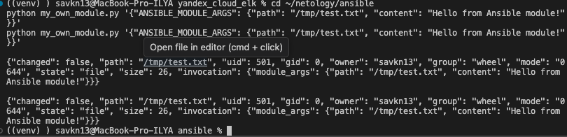
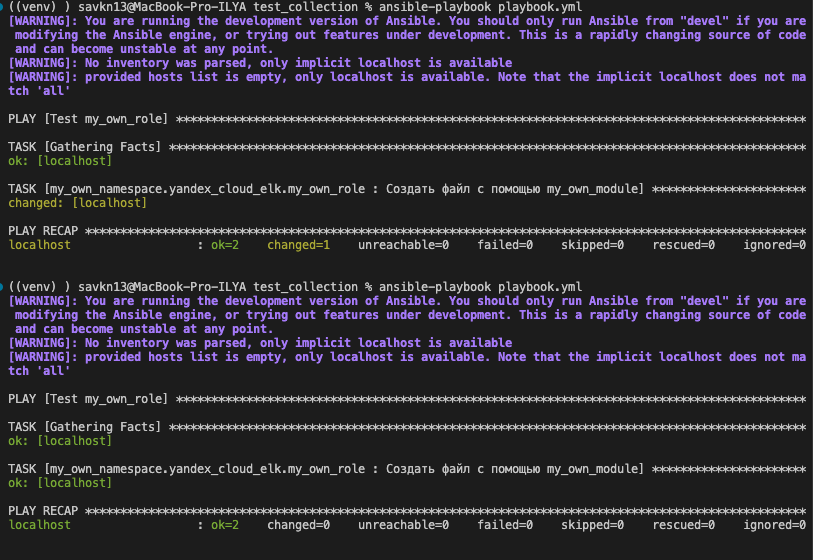
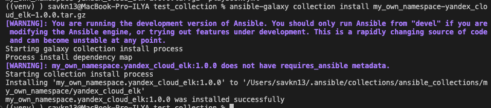
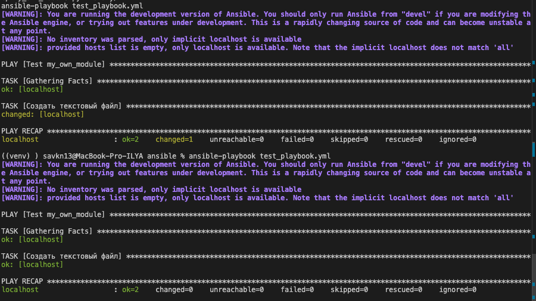

# Домашнее задание к занятию 6 «Создание собственных модулей»

## Ссылки

- **Collection репозиторий**: https://github.com/SavkinILYA/my_own_collection
- **Тег**: `1.0.0`
- **Архив**: `my_own_namespace-yandex_cloud_elk-1.0.0.tar.gz`

---

## Шаг 1-3 — Создание модуля my_own_module.py

Модуль создаёт текстовый файл на удалённом хосте по пути `path` с содержимым `content`. Поддерживает идемпотентность — если файл уже существует с таким же содержимым, `changed: false`.

```python
#!/usr/bin/python
from __future__ import (absolute_import, division, print_function)
__metaclass__ = type

DOCUMENTATION = r'''
---
module: my_own_module
short_description: Creates a text file with specified content
version_added: "1.0.0"
description: This module creates a text file on a remote host at the specified path with the specified content.
options:
    path:
        description: Path to the file to create.
        required: true
        type: str
    content:
        description: Content to write to the file.
        required: true
        type: str
author:
    - SavkinILYA (@SavkinILYA)
'''

import os
from ansible.module_utils.basic import AnsibleModule

def run_module():
    module_args = dict(
        path=dict(type='str', required=True),
        content=dict(type='str', required=True)
    )
    result = dict(changed=False, path='')
    module = AnsibleModule(argument_spec=module_args, supports_check_mode=True)

    path = module.params['path']
    content = module.params['content']
    result['path'] = path

    if os.path.exists(path):
        with open(path, 'r') as f:
            if f.read() == content:
                module.exit_json(**result)

    if module.check_mode:
        result['changed'] = True
        module.exit_json(**result)

    try:
        with open(path, 'w') as f:
            f.write(content)
        result['changed'] = True
    except Exception as e:
        module.fail_json(msg=f'Failed to create file: {str(e)}', **result)

    module.exit_json(**result)

def main():
    run_module()

if __name__ == '__main__':
    main()
```

---

## Шаг 4 — Проверка модуля локально (пункт 4)

```bash
python my_own_module.py '{"ANSIBLE_MODULE_ARGS": {"path": "/tmp/test.txt", "content": "Hello from Ansible module!"}}'
```



Оба запуска возвращают `changed: false` — файл уже существовал с таким же содержимым, модуль работает идемпотентно.

---

## Шаг 5-6 — Single task playbook и идемпотентность (пункт 6)

```yaml
---
- name: Test my_own_module
  hosts: localhost
  tasks:
    - name: Создать текстовый файл
      my_own_module:
        path: /tmp/test_playbook.txt
        content: "Hello from playbook!"
```



- Первый запуск: `changed=1` — файл создан
- Второй запуск: `changed=0` — файл уже существует, изменений нет

---

## Шаг 8 — Инициализация collection

```bash
ansible-galaxy collection init my_own_namespace.yandex_cloud_elk
```

### Структура collection

```
my_own_namespace/yandex_cloud_elk/
├── galaxy.yml
├── playbook.yml
├── plugins/
│   └── modules/
│       └── my_own_module.py
└── roles/
    └── my_own_role/
        ├── defaults/
        │   └── main.yml
        └── tasks/
            └── main.yml
```

---

## Шаг 10 — Роль my_own_role

**defaults/main.yml** — параметры по умолчанию:
```yaml
---
file_path: "/tmp/my_own_file.txt"
file_content: "Hello from my_own_role!"
```

**tasks/main.yml** — использует модуль из collection:
```yaml
---
- name: Создать файл с помощью my_own_module
  my_own_namespace.yandex_cloud_elk.my_own_module:
    path: "{{ file_path }}"
    content: "{{ file_content }}"
```

---

## Шаг 11 — Playbook для collection

```yaml
---
- name: Test my_own_role
  hosts: localhost
  roles:
    - my_own_namespace.yandex_cloud_elk.my_own_role
```

---

## Шаг 13 — Сборка архива

```bash
cd my_own_namespace/yandex_cloud_elk
ansible-galaxy collection build
```

Создан архив: `my_own_namespace-yandex_cloud_elk-1.0.0.tar.gz`

---

## Шаг 15 — Установка collection из архива (пункт 15)

```bash
ansible-galaxy collection install my_own_namespace-yandex_cloud_elk-1.0.0.tar.gz
```



```
my_own_namespace.yandex_cloud_elk:1.0.0 was installed successfully
```

---

## Шаг 16 — Запуск playbook из collection (пункт 16)

```bash
ansible-playbook playbook.yml
```



- Первый запуск: `changed=1` — файл создан
- Второй запуск: `changed=0` — идемпотентность подтверждена
